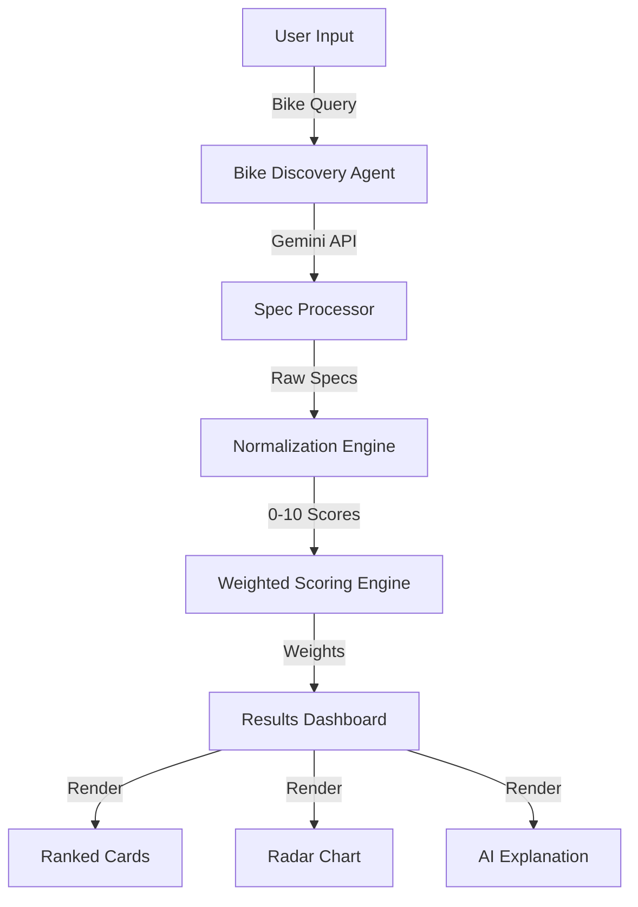

# 🏍️ Motologix

> **AI assists. Math decides. Humans approve.**

An AI-powered, explainable motorcycle decision system that helps riders and families make rational, data-backed motorcycle choices through transparent scoring and AI-assisted explanations.


---

## 🎯 What is Motologix?

Unlike static motorcycle comparison websites, Motologix combines **deterministic scoring** with **controlled AI reasoning** to produce recommendations that are:

- ✅ **Transparent** - Every score is auditable with clear formulas
- ✅ **Explainable** - Plain-language explanations for non-enthusiasts
- ✅ **Adaptable** - Works with any motorcycle via real-time AI discovery
- ✅ **Balanced** - Weighs safety, comfort, enjoyment, and practicality

This system is built for **long-term ownership decisions**, not impulse purchases.

---

## ✨ Key Features (v1.0.0)

### 🎨 Visuals & UI
- **Award-Winning Design**: Glassmorphism, blurred cards, and premium gradients using `oklch` colors.
- **Theme Support**: Seamless Light/Dark mode toggle with persistent preferences.
- **Premium Animations**: Staggered entry animations, smooth hover states, and spring physics using Framer Motion.
- **Responsive**: Fully responsive design for mobile, tablet, and desktop.

### 🧠 Core Engine
- **2025 Model Data**: Explicitly targets 2025 variants (e.g., KTM Duke 390 Gen 3, Himalayan 450).
- **Smart Discovery**: Uses Google Gemini to find real specifications (power, torque, suspension, etc.).
- **Deterministic Scoring**: 10 Weighted factors normalized to human-readable scores.
- **Detailed Specs**: Tracks detailed specs like Cornering ABS, Suspension Travel, and Ex-showroom pricing.

### 🛡️ Explainer Modes
- **Why This Ranking?**: Technical breakdown of why a bike won based on math.
- **Parent Mode 👨‍👩‍👧**: Toggles explanation to a simplified, safety-focused summary for family approval.
- **Trade-offs**: Explicitly lists downsides (e.g., "Stiff suspension," "High heat in traffic").

---

## 🏗️ Architecture



### Tech Stack
- **Framework**: Next.js 14 (App Router)
- **Language**: TypeScript
- **Styling**: Tailwind CSS v4, shadcn/ui, Lucide Icons
- **State**: Zustand (with persistence)
- **AI**: Google Gemini Pro (via Vercel AI SDK patterns)
- **Charts**: Recharts
- **Animation**: Framer Motion

---

## 📊 Evaluation Factors

Each motorcycle is scored on a **1-10 scale** for these factors:

| Factor | Default Weight | Category |
|--------|---------------|----------|
| Daily Traffic Ease | 12% | Practicality |
| Braking & Safety Confidence | 15% | Safety |
| Pillion Comfort | 15% | Comfort |
| Highway Stability | 10% | Safety |
| Rider Comfort | 10% | Comfort |
| Suspension Compliance | 10% | Comfort |
| Fun & Engagement | 8% | Enjoyment |
| Heat Management | 5% | Practicality |
| Ownership Practicality | 8% | Practicality |
| Long-Term Suitability | 7% | Practicality |

**Total: 100%** (weights are fully customizable via sliders)

---

## 🚀 Getting Started

### Prerequisites

- Node.js 20+
- npm or yarn
- Gemini API key ([get one here](https://aistudio.google.com/))

### Installation

```bash
# Clone the repository
git clone https://github.com/sandy-sachin7/motologix.git
cd motologix

# Install dependencies
npm install

# Set up environment variables
cp .env.example .env.local
# Edit .env.local and add your GEMINI_API_KEY

# Start development server
npm run dev
```

Open [http://localhost:3000](http://localhost:3000) in your browser.

### Build for Production

```bash
npm run build
npm start
```

---

## 🔧 Environment Variables

| Variable | Description | Required |
|----------|-------------|----------|
| `GEMINI_API_KEY` | Google Gemini API key for bike discovery and explanations | Yes |

---

## 🤖 AI Usage Constraints

### AI is allowed to:
- ✅ Aggregate and summarize reviews
- ✅ Infer qualitative comfort and stability trends
- ✅ Generate explanations and comparisons
- ✅ State uncertainty clearly

### AI is NOT allowed to:
- ❌ Invent specifications
- ❌ Override deterministic scoring
- ❌ Hide confidence levels
- ❌ Produce hype-driven language

**Every AI-generated insight includes a confidence label** (High/Medium/Low).

---

## 🤝 Contributing

Contributions are welcome! Please follow the atomic commit pattern:

```bash
git commit -m "feat(component): description of change"
```

Commit types: `feat`, `fix`, `docs`, `style`, `refactor`, `test`, `chore`

---

## 📄 License

MIT License - see [LICENSE](LICENSE) for details.

---

## 🙏 Acknowledgments

- **Gemini API** - For AI-powered bike discovery and explanations
- **shadcn/ui** - For beautiful, accessible UI components
- **Recharts** - For radar charts and visualizations
- **Framer Motion** - For award-winning animations

---

<p align="center">
  <strong>AI assists. Math decides. Humans approve.</strong>
</p>
